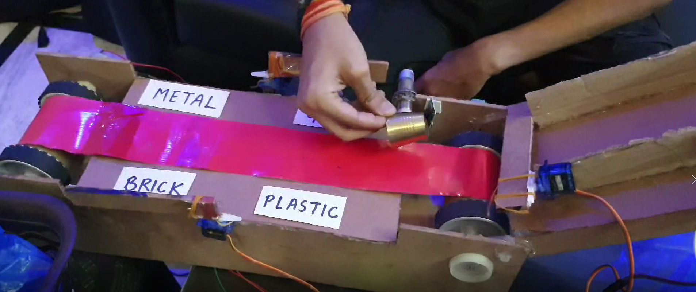
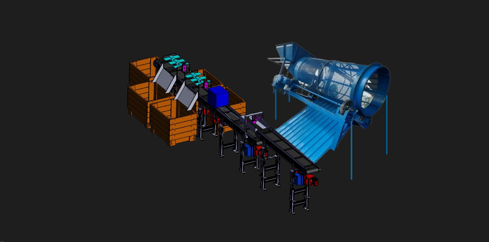
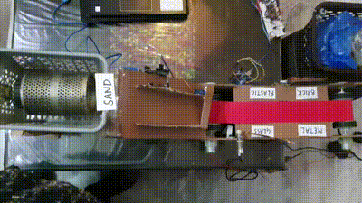

# RenewX

RenewX is an AI-based machine that automatically segregates mixed construction waste and sells it to industries for recycling purposes. This project aims to contribute to waste management and promote sustainable practices in the construction industry.

Link: https://youtu.be/9h1e3hOQH7E

| PROTOTYPE 
| ----------- |
|  |

| WEBSITE
| ----------- |
|  |

| Analysis | Demonstration |
|---------|---------|
| ||

| FUTURE IMPROVEMENT
| ----------- |
|  |

## Table of Contents
- [Introduction](#introduction)
- [Features](#features)
- [Technologies Used](#technologies-used)
- [Usage](#usage)
- [Contributing](#contributing)
- [License](#license)

## Introduction

Construction waste management is a crucial aspect of sustainable development. RenewX addresses this challenge by employing AI technology to automate the segregation process of construction waste. By accurately identifying and sorting various materials, RenewX contributes to efficient recycling and reduces the environmental impact of construction activities.

## Features

- Automatic segregation of mixed construction waste
- High accuracy in material identification
- Streamlined recycling process
- User-friendly interface
- Scalable architecture for large-scale operations

## Technologies Used

RenewX is built using the following technologies:

- Machine Learning
- Computer Vision
- Python
- TensorFlow
- OpenCV
- Flask
- HTML/CSS/JavaScript
- Internet of Things
- Raspberry Pi
- Arduino & Hardware sensors

## Usage

1. Upload an image or video of mixed construction waste to the RenewX web application.
2. RenewX will automatically analyze and segregate the waste materials.
3. View the results and download reports for recycling.

## Contributing

Contributions to RenewX are welcome! To contribute, follow these steps:

1. Fork the repository.
2. Create a new branch: `git checkout -b feature-new-feature`.
3. Make your changes and commit them: `git commit -m 'Add new feature'`.
4. Push to the branch: `git push origin feature-new-feature`.
5. Submit a pull request.

## License

RenewX is licensed under the MIT License. See [LICENSE](LICENSE) for more information.

